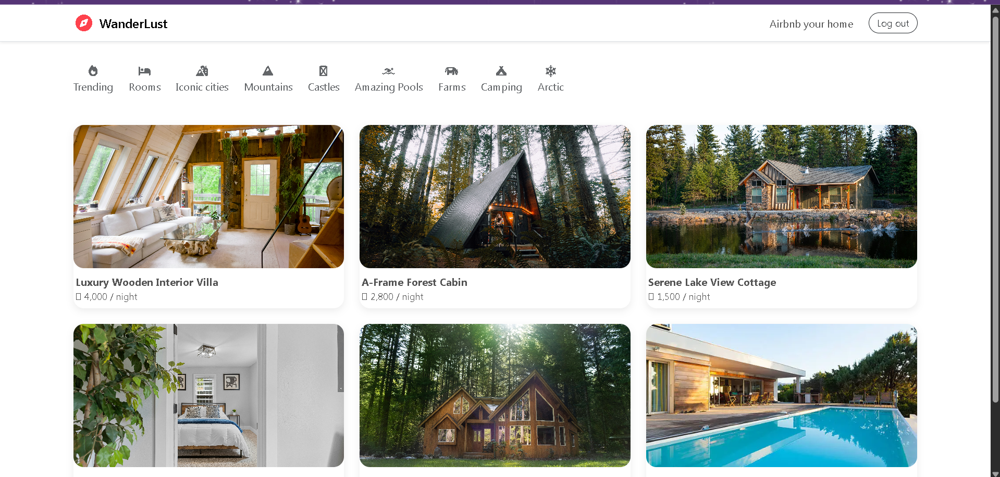
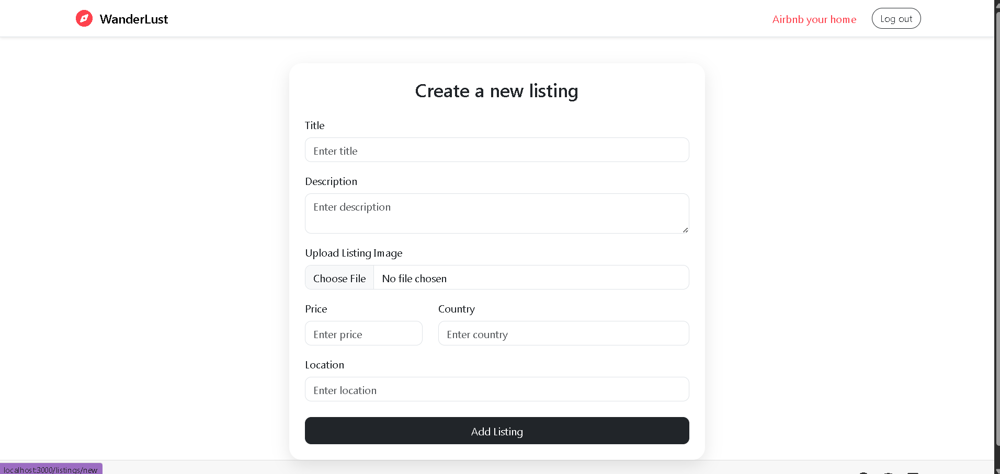
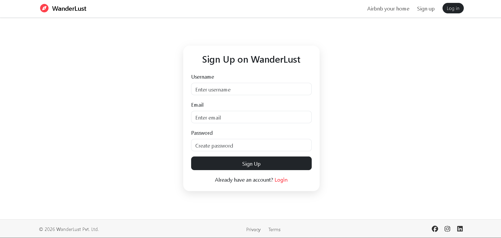
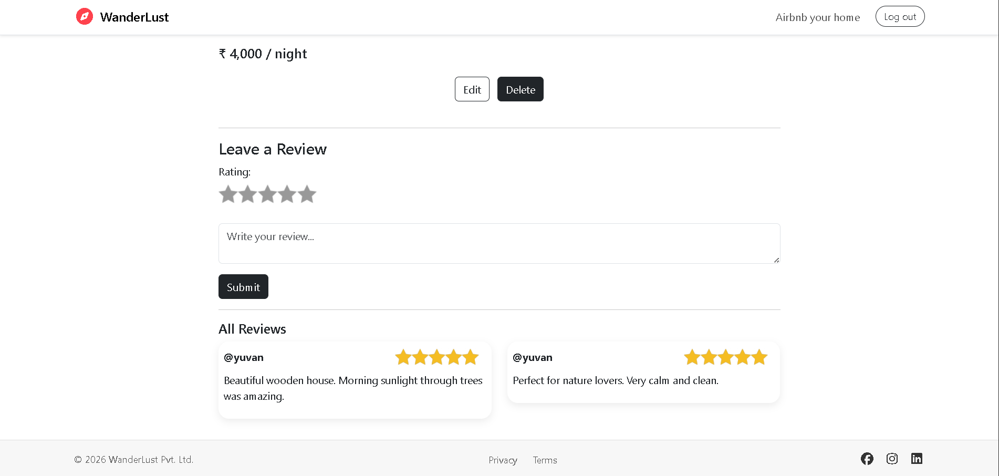

# 🌍 WanderLust – Vacation Rental Web App

WanderLust is a full-stack vacation rental web application focused on backend architecture, secure authentication, and production-ready deployment.

---

## 🚀 Live Demo

👉 https://wanderlust-1sk0.onrender.com

---

## ✨ Key Features

### 🔐 Authentication & Security

* User authentication using Passport.js
* Password hashing with bcrypt
* Session management with express-session
* MongoDB session store using connect-mongo
* Protected routes & authorization

### 🏡 Listings Management

* Full CRUD operations for listings
* Image upload & storage using Cloudinary
* Clean card-based UI
* Fully responsive design

### ⭐ Reviews & Ratings

* Add reviews with star rating system
* Delete only own reviews (authorization)
* One-to-many relationship (Listings → Reviews)

### ⚡ Backend & Architecture

* MVC architecture
* RESTful API design
* Centralized error handling
* Async error wrapper (wrapAsync)

### 🛡 Validation

* Schema validation using Joi
* Server-side validation for listings & reviews

### 💬 Flash Messages

* Success & error alerts using connect-flash

---

## 🛠 Tech Stack

### 🔧 Backend

* Node.js
* Express.js
* MongoDB Atlas

### 🎨 Frontend

* EJS
* Bootstrap 5
* Custom CSS

### 🔐 Authentication

* Passport.js
* express-session
* connect-mongo

### ☁️ Cloud & Deployment

* Render
* Cloudinary

### 🛡 Validation

* Joi

---

## 🧠 Concepts Implemented

* MVC Architecture
* REST APIs
* Authentication & Authorization
* Middleware
* Session handling
* MongoDB relationships
* Cloud storage integration
* Error handling

---

## 📂 Folder Structure

```
models/        → Mongoose schemas  
routes/        → Express routes  
controllers/   → Business logic  
middleware/    → Auth & validation  
views/         → EJS templates  
public/        → Static files  
utils/         → Custom error handlers  
```

---

## ⚙️ Installation & Setup

```bash
git clone https://github.com/your-username/wanderlust.git
cd wanderlust
npm install
```

Create `.env` file:

```env
ATLASDB_URL=your_mongodb_atlas_url
SECRET=your_session_secret
CLOUDINARY_CLOUD_NAME=your_cloud_name
CLOUDINARY_KEY=your_key
CLOUDINARY_SECRET=your_secret
```

Run project:

```bash
npm start
```

---

## 📸 Screenshots

### 🏠 Home Page



### ➕ Create Listing



### 🔐 Signup Page



### ⭐ Reviews Section



---

## 🎯 Project Purpose

This project was built to:

* Strengthen backend development skills
* Understand real-world application architecture
* Implement secure authentication
* Practice cloud deployment
* Prepare for backend/full-stack interviews

---

## 🚧 Current Status

* Improving UI & performance
* Enhancing scalability

---

## 🛣 Upcoming Features

* 🔍 Advanced search & filtering
* 📄 Pagination
* ❤️ Wishlist system
* 🗺 Map integration
* ⚡ Performance optimization

---

## 👨‍💻 Author

Ravikant
📍 Haryana, India

---

## ⭐ Support

If you like this project, give it a ⭐ on GitHub!   